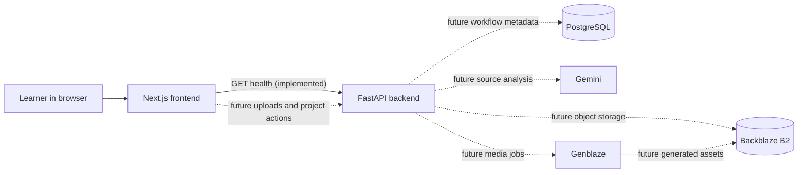

# ZeroBacklog

> **Stop Saving. Start Learning.**

**One-line pitch:** Upload everything you have been postponing and leave with one clear learning path.

ZeroBacklog is a submission in development for the **Backblaze Generative Media Hackathon**. It is intended to turn a learner's scattered coding-preparation backlog into a verified, personalized, multimedia Action Pack.

> **Current status — foundation milestone:** the repository currently implements a responsive Next.js product preview, a FastAPI service with two health endpoints, environment-based configuration, safe logging, CORS, exception handling, and backend tests. Resource ingestion, AI analysis, Genblaze generation, database persistence, and Backblaze B2 storage are **planned and not yet implemented**.

## The problem

Coding students collect useful material faster than they can process it: YouTube videos, PDFs, screenshots, personal notes, interview roadmaps, and coding sheets. The queue grows, repeated advice is hard to spot, contradictions remain unresolved, and deciding what to study next becomes work of its own.

Saving feels productive. An unprioritized backlog is not a learning plan.

## The proposed solution

ZeroBacklog will reduce a mixed collection of saved resources into a transparent action plan. The planned system will:

- validate each resource and clearly report what it could or could not process;
- extract comparable source material while retaining provenance;
- identify repeated concepts, unique insights, contradictions, and coding-sheet overlap;
- recommend what to consume, skim, practice, or safely skip;
- generate concise notes, diagrams, revision cards, and voice lessons;
- evaluate generated assets and selectively retry weak outputs;
- version source and generated artifacts in Backblaze B2; and
- package the result into a downloadable Action Pack.

The goal is not to summarize everything. It is to reduce decision load without hiding uncertainty.

## Intended student workflow

1. Create a learning project for a goal such as interview preparation.
2. Add postponed videos, documents, screenshots, notes, and coding sheets.
3. Review validation results and resolve unsupported or unreadable inputs.
4. Let ZeroBacklog compare the usable material.
5. Review a prioritized path with consume, skim, practice, and skip decisions.
6. Inspect the evidence and confidence behind those decisions.
7. Generate the text, visual, and voice assets that are actually useful.
8. Regenerate only an unsatisfactory asset instead of rerunning the whole project.
9. Download the versioned Action Pack and start the next recommended task.

Steps 1–9 describe the intended hackathon MVP experience; they are not implemented in this foundation milestone.

## Planned key features

| Capability | Why it matters | Milestone status |
| --- | --- | --- |
| Mixed-resource ingestion | Meets students where their backlog already lives | Planned |
| Validation and transparency states | Prevents silent data loss and false confidence | Planned |
| Cross-resource knowledge reduction | Finds repetition, gaps, contradictions, and unique value | Planned |
| Action-oriented prioritization | Replaces a queue with an executable sequence | Planned |
| Source-linked recommendations | Makes each decision inspectable | Planned |
| Text, image, and voice generation | Supports multiple learning and revision modes | Planned |
| Output evaluation and selective retry | Improves quality without repeating successful work | Planned |
| B2-backed objects and versions | Preserves originals, derivatives, provenance, and downloads | Planned |
| Service health visibility | Gives developers immediate frontend/backend feedback | Implemented |

## Planned knowledge-reduction pipeline

`Upload → Validate → Extract → Analyze → Decide → Generate → Evaluate → Retry → Store → Version → Download`

| Stage | Planned responsibility |
| --- | --- |
| Upload | Accept supported resources and record source metadata. |
| Validate | Check type, size, readability, availability, and support level. |
| Extract | Derive text or structured source material without losing provenance. |
| Analyze | Compare topics, repetition, contradictions, gaps, and likely value. |
| Decide | Produce explainable consume, skim, practice, and skip recommendations. |
| Generate | Ask Genblaze workflows for selected text, image, and voice assets. |
| Evaluate | Apply format, grounding, completeness, and quality checks. |
| Retry | Regenerate only the failed or low-quality asset with bounded attempts. |
| Store | Persist source and derivative objects in Backblaze B2. |
| Version | Link every output version to inputs, prompts, model, and evaluation state. |
| Download | Assemble an Action Pack from approved, versioned assets. |

Only the health and product-preview foundation is implemented today.

## Planned Backblaze B2 usage

Backblaze B2 is intended to be the durable object layer, not a decorative upload destination. The planned integration will store:

- original user uploads as immutable source objects;
- normalized extraction artifacts;
- generated notes, cards, diagrams, audio, and pack manifests;
- evaluation reports and retry derivatives;
- downloadable Action Pack archives; and
- object metadata needed to connect every derivative to its source version.

PostgreSQL will hold searchable workflow metadata and object references; B2 will hold the bytes. Planned object keys will be scoped by project and resource identifiers rather than user-provided filenames. Checksums, content type, source version, generation attempt, and lifecycle state will be recorded. Downloads will use short-lived authorized URLs or a controlled backend stream. Retention and cleanup rules will be part of a later storage milestone.

No B2 SDK calls or buckets are used by the current code.

## Planned Genblaze usage

Genblaze is intended to orchestrate the generative-media portion of the pipeline after ZeroBacklog has made a learning decision. Planned workflows will:

- receive a bounded, source-linked generation brief;
- create the required text, image, or voice asset;
- store the result and its provenance in B2;
- trigger output-specific evaluation;
- retry only failed assets within a fixed attempt budget; and
- expose version history so the learner can keep or replace an individual result.

The final demo should show real orchestration across more than one media type, a visible evaluation outcome, at least one selective regeneration, and resulting B2 object versions. Genblaze is not integrated in this milestone.

## Architecture overview

The repository is a lightweight monorepo with independently runnable frontend and backend applications.



Solid edges are implemented. Dashed edges are planned.

For boundaries, data flow, failure strategy, and low-memory constraints, see [docs/architecture.md](docs/architecture.md).

## Technology stack

| Layer | Technology | Current use |
| --- | --- | --- |
| Web | Next.js 15, React 19, TypeScript | Implemented |
| Styling | Tailwind CSS 4 plus project CSS | Implemented |
| API | Python 3.12, FastAPI, Pydantic Settings | Implemented |
| API server | Uvicorn | Implemented |
| Tests | Pytest, FastAPI TestClient/httpx | Implemented |
| Relational data | PostgreSQL | Planned |
| Analysis | Gemini | Planned |
| Media orchestration | Genblaze | Planned |
| Object storage | Backblaze B2 | Planned |

## Repository structure

```text
ZeroBacklog/
├── backend/
│   ├── app/
│   │   ├── api/              # HTTP routes and router composition
│   │   ├── core/             # Settings, logging, and exception policy
│   │   ├── models/           # Public response contracts
│   │   └── main.py           # FastAPI factory and ASGI application
│   ├── tests/                # Backend contract tests
│   ├── requirements.txt      # Runtime Python dependencies
│   └── requirements-dev.txt  # Test dependencies
├── frontend/
│   ├── app/                  # Next.js App Router pages and global styles
│   ├── components/           # Focused interactive components
│   ├── lib/                  # Browser-safe configuration
│   └── types/                # Frontend API contracts
├── docs/                     # Architecture, product, alignment, and demo plans
├── .env.example              # Placeholder-only configuration reference
├── package.json              # Root frontend convenience scripts
└── pnpm-workspace.yaml       # JavaScript workspace definition
```

`backend/.env` and `frontend/.env.local` are intentionally absent from this tree because Git ignores them.

## Local setup

### Prerequisites

- Node.js 20 or newer
- pnpm 11 (the repository records the expected version)
- Python 3.12
- Git

The current foundation runs without external AI, database, or B2 credentials. Local frontend/backend URLs are still required.

### Windows PowerShell

From the repository root:

```powershell
# Install frontend dependencies.
corepack enable
corepack prepare pnpm@11.9.0 --activate
pnpm install

# Create and populate the backend virtual environment.
py -3.12 -m venv backend/.venv
backend\.venv\Scripts\Activate.ps1
python -m pip install --upgrade pip
python -m pip install -r backend\requirements-dev.txt
```

Create local configuration only when the target file does not already exist:

```powershell
if (-not (Test-Path backend\.env)) {
    Copy-Item .env.example backend\.env
}

if (-not (Test-Path frontend\.env.local)) {
    'NEXT_PUBLIC_API_BASE_URL=http://localhost:8000' |
        Set-Content frontend\.env.local
}
```

Replace all angle-bracketed values in `backend/.env` before enabling future integrations. For the current foundation, set:

```dotenv
FRONTEND_URL=http://localhost:3000
APP_ENV=development
```

Never run the copy commands over an existing local environment file.

## Environment variables

The root `.env.example` is a reference list. Backend values belong in `backend/.env`; the public frontend value belongs in `frontend/.env.local`.

| Variable | Application | Secret? | Purpose / placeholder |
| --- | --- | --- | --- |
| `GEMINI_API_KEY` | Backend | Yes | Future Gemini access; `<set-locally>` |
| `YOUTUBE_API_KEY` | Backend | Yes | Future YouTube metadata access; `<set-locally>` |
| `DATABASE_URL` | Backend | Yes | Future PostgreSQL connection; `<postgresql-connection-string>` |
| `B2_APPLICATION_KEY_ID` | Backend | Yes | Future scoped B2 key ID; `<set-locally>` |
| `B2_APPLICATION_KEY` | Backend | Yes | Future scoped B2 application key; `<set-locally>` |
| `B2_BUCKET_NAME` | Backend | Treat as internal | Future object bucket; `<bucket-name>` |
| `B2_ENDPOINT` | Backend | Treat as internal | Future B2 S3-compatible endpoint; `<b2-s3-endpoint>` |
| `B2_REGION` | Backend | No | Future B2 region; `<b2-region>` |
| `FRONTEND_URL` | Backend | No | Exact allowed browser origin; local value `http://localhost:3000` |
| `APP_ENV` | Backend | No | Runtime label such as `development` |
| `NEXT_PUBLIC_API_BASE_URL` | Frontend | Public by design | Browser-visible API base; local value `http://localhost:8000` |

Variables prefixed with `NEXT_PUBLIC_` are shipped to the browser and must never contain credentials.

## Development commands

Run the backend from one PowerShell terminal:

```powershell
Set-Location backend
.\.venv\Scripts\Activate.ps1
python -m uvicorn app.main:app --reload --host 127.0.0.1 --port 8000
```

Run the frontend from a second terminal at the repository root:

```powershell
pnpm dev:frontend
```

Open `http://localhost:3000`. The header should move from **Checking API** to **API connected**. If the backend is stopped or misconfigured, the indicator shows **API unavailable** and offers a keyboard-accessible retry.

### Production-style checks

```powershell
pnpm lint:frontend
pnpm build:frontend

Set-Location backend
.\.venv\Scripts\Activate.ps1
python -m pytest
```

Direct health checks:

```powershell
Invoke-RestMethod http://localhost:8000/health
Invoke-RestMethod http://localhost:8000/api/v1/health
```

Both return the same public fields: `service`, `status`, `version`, and `environment`.

## Security and privacy notes

- Local environment files are ignored; placeholder files contain no usable credentials.
- Backend secrets and the database connection string are modeled as Pydantic `SecretStr` fields.
- The logging filter redacts common key/value, bearer-token, and connection-string shapes.
- Health responses intentionally expose no configuration values beyond service metadata.
- CORS allows only the configured `FRONTEND_URL`; credentials are disabled for the current public health route.
- Central exception handling prevents unhandled stack traces and submitted values from entering public responses.
- Future uploads must be validated by content, not trusted extensions, and should receive generated object names.
- Future downloads should use short-lived authorization and project-level access checks.
- Future prompts, extracted content, and generated assets should be treated as user data with explicit retention and deletion rules.
- Never put a secret in a `NEXT_PUBLIC_` variable, URL query parameter, log message, object key, or client error.

This is a secure starting point, not a completed security review. Authentication, authorization, upload scanning, rate limits, retention controls, and production secrets management are future requirements.

## Current implementation status

### Implemented

- responsive, semantic Next.js product page;
- product identity, problem framing, and future-pipeline preview;
- disabled Action Pack control with an honest milestone label;
- frontend health loading, success, failure, timeout, and retry states;
- `NEXT_PUBLIC_API_BASE_URL` configuration;
- FastAPI application factory and structured package;
- `GET /health` and `GET /api/v1/health`;
- centralized settings from `backend/.env`;
- configured-origin CORS;
- structured JSON logs with secret redaction;
- centralized public exception responses; and
- health endpoint and CORS tests.

### Not implemented

- user accounts or project persistence;
- uploads, validation, extraction, or YouTube processing;
- PostgreSQL models or migrations;
- Gemini analysis;
- Genblaze workflows;
- Backblaze B2 access;
- generation, evaluation, retry, versioning, or download.

## Known limitations

- The health indicator checks only API reachability and response shape, not downstream services.
- The frontend has no upload interaction in this milestone.
- CORS accepts a comma-delimited origin string but has not been exercised behind a production proxy.
- Logging redaction is defense in depth, not permission to log secret-bearing objects.
- There is no CI pipeline, container image, deployment manifest, telemetry backend, or load test yet.
- Dependency vulnerability scanning and browser-level accessibility testing are not automated yet.
- The example product metrics in the UI are clearly a preview, not computed values.

## Planned milestones

1. **Foundation** — product preview, API health, safe configuration, tests, and core documentation. **Current.**
2. **Ingestion** — project model, secure uploads, validation states, B2 originals, and metadata persistence.
3. **Extraction** — format-specific extractors, provenance spans, asynchronous job state, and partial-result handling.
4. **Knowledge reduction** — Gemini comparison, evidence-linked decisions, confidence, and learner controls.
5. **Generative media** — Genblaze text/image/voice workflows, evaluation, selective retry, and B2 versions.
6. **Action Pack** — result experience, manifest, authorized download, deletion/retention controls, and demo dataset.
7. **Hardening** — observability, rate limits, abuse controls, security review, accessibility audit, CI, and deployment.

## Hackathon judging-criteria alignment

| Criterion | ZeroBacklog intent | Evidence required in the final submission |
| --- | --- | --- |
| Real-world Utility | Remove decision fatigue from a real student learning backlog | A believable mixed backlog, measurable reduction, evidence-linked next steps, and learner-facing transparency |
| Production Readiness | Make failures, provenance, security boundaries, and retries visible | Deployed health, safe configuration, tests, job states, partial failures, access controls, and reproducible setup |
| B2 Storage + Data Orchestration | Use B2 as the durable system for originals, derivatives, evaluations, versions, and downloads | Live object creation, metadata/provenance, versioned regeneration, scoped retrieval, and final pack download |
| Use of Genblaze | Orchestrate genuinely useful multi-format generation with quality control | Real text/image/voice workflows, output evaluation, selective retry, and stored result versions |

The detailed evidence plan is in [docs/hackathon-alignment.md](docs/hackathon-alignment.md).

## Project documents

- [Architecture](docs/architecture.md)
- [Product specification](docs/product-spec.md)
- [Hackathon alignment](docs/hackathon-alignment.md)
- [Preliminary demo plan](docs/demo-plan.md)

## License and status

ZeroBacklog is an early hackathon project. **No standalone project license has been selected yet.** Until a license is added, do not assume permission to copy, distribute, or reuse the project outside applicable law and explicit contributor agreements.
