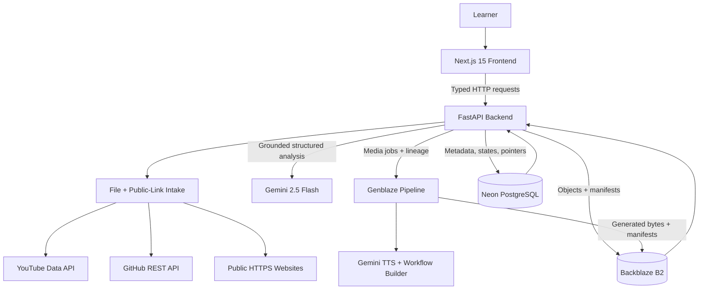

# ZeroBacklog

**Stop Saving. Start Learning.**

ZeroBacklog turns scattered coding resources into one evidence-backed Action Pack, then generates, versions, stores, and packages the learning assets that matter.

| Submission link | Status |
| --- | --- |
| Live demo | _Not published yet_ |
| Demo video | _Not published yet_ |
| Devpost | _Not published yet_ |

Built for the **Backblaze Generative Media Hackathon**.

## The problem

Coding learners save good material with good intentions: YouTube videos, GitHub repositories, PDFs, screenshots, personal notes, interview roadmaps, coding sheets, and documentation.

The trouble starts when those saved treasures become a second backlog. The collection is too large to consume, the same ideas appear in several places, useful exceptions are buried, and deciding what to study next takes time that could have been spent learning.

ZeroBacklog exists to recover that value.

## The solution

ZeroBacklog does not summarize every resource in isolation.

Files and public links are validated, extracted, and classified before analysis. The learner can remove, replace, retry, or approve uncertain material.

Gemini compares only ready or approved resources to find repetition, unique insights, contradictions, essential sources, skippable material, and the best place to start. Selected assets then move through Genblaze, Backblaze B2, and Neon PostgreSQL for evaluation, versioning, and download.

## What ZeroBacklog does

- **Accepts files and public links:** PDFs, text and subtitle files, supported images, safe ZIP archives, YouTube links, GitHub repositories, coding sheets, and public documentation pages.
- **Checks readiness before analysis:** detects corrupt, unreadable, unsupported, irrelevant, partial, low-confidence, inaccessible, and duplicate resources.
- **Reduces knowledge across sources:** compares approved resources and grounds recommendations in resource IDs, titles, available locations, confidence, and evidence basis.
- **Personalizes selected outputs:** the learner profile is optional, and any combination of seven output types can be requested.
- **Builds useful learning assets:** the Action Pack becomes an interactive Learning Workflow and a playable voice lesson.
- **Regenerates selectively:** one note, workflow, or voice lesson can be rebuilt without regenerating the pack.
- **Records every attempt:** Every generation attempt is recorded. Successful assets receive immutable B2 versions, while failures remain visible in the audit history without replacing the latest working version.
- **Packages the result:** current successful assets can be downloaded individually or as a combined ZIP.

## User journey

```mermaid
flowchart LR
    profile["Profile + Output Selection"] --> intake["Upload Files and Links"]
    intake --> readiness["Resource Readiness"]
    readiness --> reduction["Knowledge Reduction"]
    reduction --> pack["Action Pack"]
    pack --> media["Generated Media"]
    media --> evaluation["Evaluation"]
    evaluation --> regeneration["Selective Regeneration"]
    regeneration --> history["Version History"]
    history --> download["Download"]
```



One inaccessible link or failed media asset does not invalidate the rest of the project.

## What makes it different

| Product category | Typical focus | ZeroBacklog's focus |
| --- | --- | --- |
| Video summarizer | Condense one video | Compare mixed resources and remain explicit when no transcript exists |
| Note-taking app | Help store more information | Reduce what must be consumed and identify what can be skipped |
| AI tutor | Generate explanations conversationally | Build a grounded plan from the learner's own backlog |
| Bookmark manager | Organize saved links | Validate, extract, compare, decide, generate, version, and package |

The core product is **knowledge reduction**: spend less time repeating material without losing the rare insight found in one source.

## Real output

- **Backlog Reduction** — what is essential, optional, repeated, or skippable.
- **Start Here** — the best next resource or topic and why.
- **Common and Unique Insights** — repeated concepts without losing rare value.
- **Contradictions** — competing advice with evidence for each side.
- **Resource Verdicts** — use fully, use selected sections, reference, or skip.
- **Merged Notes** — concise notes, clues, mistakes, memory cues, and pseudocode.
- **Priority Problems** — normalized must-do, useful, and optional problems.
- **Learning Workflow** — an expandable, color-coded roadmap from Start Here to Interview Ready.
- **Generated Voice** — normal or quick-revision WAV lessons.
- **Version History** — compare, restore, inspect, and download any stored version.
- **Downloads** — individual assets or a combined ZIP with `provenance.json`.

The workflow is derived from the current Action Pack, not a static template: its topics, mistakes, problems, practice order, revision cues, evidence counts, and timing come from the learner's approved resources.

## Architecture



### Responsibilities

| Component | Responsibility |
| --- | --- |
| Next.js frontend | Profile and output selection, upload and link intake, readiness decisions, Action Pack presentation, evidence, media playback, versions, and downloads |
| FastAPI backend | Validation, extraction, link safety, relevance and duplicate checks, orchestration, retries, typed errors, and download assembly |
| Gemini knowledge engine | Structured cross-resource Action Pack generation using only ready or learner-approved source material |
| Genblaze media pipeline | Per-asset pipeline runs, provider execution, lineage, manifests, and isolated media outcomes |
| Backblaze B2 | Durable bytes for source, derived, analysis, and generated objects |
| Neon PostgreSQL | Queryable project, resource, link, Action Pack, asset-version, status, and object-reference metadata |

## Backblaze B2 usage

B2 is the durable object layer for:

- validated originals and extracted text;
- readiness records, public-link snapshots, and link metadata;
- completed Action Pack JSON;
- Learning Workflow JSON and generated voice; and
- Genblaze manifests and successful `vN` asset versions.

Each write carries a SHA-256 value and is verified with an object metadata lookup. Neon stores the corresponding bucket, object key, checksum, status, version, and Genblaze run ID.

Regeneration allocates a new `vN` object key. Restoring an earlier version changes only the current pointer in Neon; existing B2 objects remain intact.

Combined ZIP downloads are currently assembled on demand from the current successful B2 objects. The backend adds a provenance manifest and streams the archive; the combined ZIP itself is not persisted as another B2 object.

## Genblaze usage

Genblaze is the execution and lineage layer for generated assets. Each selected output receives its own pipeline, grounded prompt, provider run, evaluation, B2 write, and manifest. Neon records the run ID, confidence, timing, settings, source references, and version.

On regeneration, Neon links V2 to V1 and Genblaze loads the previous successful result when its manifest is available. Note, workflow, and voice runs are independent, so one provider failure cannot replace a working version or block other outputs.

## Providers and models

The defaults below come directly from `backend/app/core/config.py` and can be overridden through environment variables.

| Purpose | Provider or model |
| --- | --- |
| Cross-resource analysis and note regeneration | `gemini-2.5-flash` |
| Voice generation | `gemini-2.5-flash-preview-tts` with the `Kore` prebuilt voice |
| Learning Workflow | Source-derived workflow builder tracked through Genblaze |
| Gemini SDK | Official `google-genai` Python SDK |
| Media orchestration and manifests | `genblaze-core` |
| B2 storage adapter | `genblaze-s3` Backblaze backend |
| YouTube metadata | YouTube Data API v3 |
| GitHub metadata and README | Public GitHub REST API |
| Relational persistence | Neon PostgreSQL through Psycopg 3 |

## Technology stack

| Layer | Technology |
| --- | --- |
| Frontend | Next.js 15.5.21, React 19.1.5, TypeScript 5.9.2, Tailwind CSS 4.1.12 |
| Backend | Python 3.12, FastAPI 0.116.1, Uvicorn, Pydantic Settings |
| AI | Gemini through `google-genai` 2.13.0 |
| Media orchestration | `genblaze-core` 0.3.4 and `genblaze-s3` 0.3.5 |
| Storage | Backblaze B2 through the Genblaze S3-compatible backend |
| Database | Neon PostgreSQL through Psycopg 3.3.4 |
| Extraction | PyPDF, Pillow, optional local Tesseract OCR |
| External APIs | YouTube Data API v3, GitHub REST API, public HTTPS pages |
| Testing | Pytest, FastAPI TestClient/httpx, Node test runner, TypeScript, ESLint |

## Repository structure

```text
ZeroBacklog/
|-- backend/
|   |-- app/
|   |   |-- api/routes/          # Health, upload, readiness, link, Action Pack, asset APIs
|   |   |-- core/                # Settings, retries, logging, centralized exceptions
|   |   |-- integrations/        # Backblaze/Genblaze storage and Neon persistence
|   |   |-- models/              # Typed request and response contracts
|   |   |-- services/            # Extraction, readiness, analysis, media, and downloads
|   |   `-- main.py              # FastAPI application factory
|   |-- tests/                   # Backend unit and API tests
|   |-- requirements.txt
|   `-- requirements-dev.txt
|-- frontend/
|   |-- app/
|   |   |-- profile/             # Optional learner profile and output selection
|   |   |-- upload/              # File/link intake and Resource Readiness
|   |   `-- results/             # Action Pack, media, versions, provenance, downloads
|   |-- components/
|   |-- lib/
|   |-- tests/
|   `-- types/
|-- docs/
|   |-- architecture.md
|   |-- demo-plan.md
|   |-- hackathon-alignment.md
|   `-- product-spec.md
|-- .env.example
|-- package.json
|-- pnpm-lock.yaml
|-- pnpm-workspace.yaml
`-- README.md
```

Local secret files, virtual environments, dependencies, build output, uploaded data, and caches are intentionally excluded by `.gitignore`.

## Local setup

### Prerequisites

- Git
- Node.js 22 or newer
- pnpm 11.9.0 through Corepack
- Python 3.12
- A Gemini API key
- A YouTube Data API key for YouTube metadata intake
- A Neon PostgreSQL connection string
- A Backblaze B2 bucket with a scoped application key

### Install dependencies

From Windows PowerShell at the repository root:

```powershell
corepack enable
corepack prepare pnpm@11.9.0 --activate
pnpm install

py -3.12 -m venv backend\.venv
backend\.venv\Scripts\Activate.ps1
python -m pip install -r backend\requirements-dev.txt
```

### Configure local environment files

Create these files only if they do not already exist:

```powershell
if (-not (Test-Path backend\.env)) {
    Copy-Item .env.example backend\.env
}

if (-not (Test-Path frontend\.env.local)) {
    'NEXT_PUBLIC_API_BASE_URL=http://localhost:8000' |
        Set-Content frontend\.env.local
}
```

Replace placeholders in `backend/.env` with credentials from your own accounts. Do not copy values into the README, commit them, or place them in a `NEXT_PUBLIC_` variable.

### Start the backend

```powershell
Set-Location backend
.\.venv\Scripts\Activate.ps1
python -m uvicorn app.main:app --reload --host 127.0.0.1 --port 8000
```

### Start the frontend

In a second terminal at the repository root:

```powershell
pnpm dev:frontend
```

Open `http://localhost:3000`.

## Environment variables

Backend variables belong in `backend/.env`. The browser-visible API URL belongs in `frontend/.env.local`.

| Variable | Required | Secret | Purpose |
| --- | --- | --- | --- |
| `GEMINI_API_KEY` | For analysis/media | Yes | Gemini knowledge reduction, evaluation, note regeneration, and TTS |
| `YOUTUBE_API_KEY` | For YouTube intake | Yes | Public YouTube metadata through Data API v3 |
| `DATABASE_URL` | Yes | Yes | Neon PostgreSQL connection string |
| `B2_APPLICATION_KEY_ID` | Yes | Yes | Scoped Backblaze application-key ID |
| `B2_APPLICATION_KEY` | Yes | Yes | Scoped Backblaze application key |
| `B2_BUCKET_NAME` | Yes | Internal | B2 bucket containing source and generated objects |
| `B2_ENDPOINT` | Reserved | Internal | Present for deployment compatibility; the current Genblaze Backblaze helper resolves the service from region and credentials |
| `B2_REGION` | Yes | No | Backblaze bucket region |
| `FRONTEND_URL` | Yes | No | Exact comma-delimited browser origin allowed by CORS |
| `APP_ENV` | No | No | Environment label such as `development` |
| `NEXT_PUBLIC_API_BASE_URL` | Yes | No | Public browser-visible FastAPI base URL |

Optional model overrides:

| Variable | Default |
| --- | --- |
| `GEMINI_MODEL` | `gemini-2.5-flash` |
| `GEMINI_TTS_MODEL` | `gemini-2.5-flash-preview-tts` |
| `GEMINI_VOICE_NAME` | `Kore` |

## Testing and verification

Run the focused checks:

```powershell
Set-Location backend
.\.venv\Scripts\Activate.ps1
python -m pytest

Set-Location ..
pnpm --dir frontend exec tsc --noEmit
pnpm --dir frontend test:selection
pnpm lint:frontend
```

Latest verified results:

| Check | Result |
| --- | --- |
| Backend suite | 35 tests passed |
| Frontend TypeScript | Passed |
| Output-selection tests | 3 passed, including all seven choices and persistence |
| Focused ESLint on stabilization files | Passed |
| Real Action Pack | Completed from three ready/approved resources |
| Learning Workflow | Seven dynamic stages; guided V1 and concise V2 stored in B2 |
| Voice generation | Valid WAV; V1 and V2 stored and restorable |
| Version comparison and restore | Workflow and voice history passed; V2 restored as current |
| B2/Neon/Genblaze consistency | Stored payload hashes, manifest versions, and run IDs matched |
| Individual download | Passed |
| Combined ZIP | Includes Action Pack, Voice V2, Learning Workflow V2, and `provenance.json` |
| Tracked-file secret scan | No Google API key, credentialed database URL, or assigned B2/API secret found |

The full-project ESLint command did not finish within the stabilization pass's five-minute environment-debugging limit, so this README does not claim a complete lint-suite result.

## Known limitations

- YouTube spoken content requires a supplied transcript; metadata-only videos remain `partial`.
- Media generation currently completes synchronously within the API request.
- OCR and mixed-language analysis are best-effort.
- Authentication is outside the hackathon build.

## Privacy and security

- Secrets stay server-side in ignored environment files.
- B2 access stays server-side through a scoped application key; production buckets should remain private, and downloads pass through FastAPI.
- File validation checks size, type, structure, corruption, and SHA-256; ZIP checks block traversal and decompression abuse.
- Public URLs are limited to HTTP(S), bounded in size and redirects, and blocked from local or private networks.
- Failed, partial, unsupported, and low-confidence states remain visible.
- Credentials never belong in frontend variables, public errors, or logs; settings and logging add secret redaction.

Detailed boundaries are documented in [docs/architecture.md](docs/architecture.md).

## Hackathon alignment

| Criterion | Evidence in ZeroBacklog |
| --- | --- |
| **Real-world Utility** | Converts a believable learner backlog into what to start, what is repeated, what is unique, what conflicts, and what can be skipped |
| **Production Readiness** | Typed APIs, deterministic validation, bounded retries, safe URL/ZIP handling, isolated failures, centralized errors, tests, and reproducible setup |
| **B2 Storage and Data Orchestration** | Originals, extracted text, snapshots, readiness records, Action Pack JSON, generated voice, manifests, checksums, and versioned assets are stored and retrieved through B2 |
| **Use of Genblaze** | Per-asset pipelines, manifests, run IDs, V1-to-V2 lineage, evaluation, and isolated provider outcomes |

## Demo

Watch the demo to see resource validation, Action Pack creation, voice generation, immutable versioning, provenance, restoration, and downloads.

## What we are proud of

We built the full path from messy saved resources to a useful Action Pack, with B2 and Genblaze doing real storage and orchestration work. The product turns saving into action while keeping provider failures honest.

## What is next

The same approach can support UPSC, NEET, SSC, GATE, JEE, professional certifications, multilingual learning, spaced revision, and collaborative study.

## Project status and license

ZeroBacklog is a hackathon submission and active prototype. No standalone project license has been selected yet. Until one is added, do not assume permission to copy, distribute, or reuse the project beyond applicable law and explicit contributor agreements.
