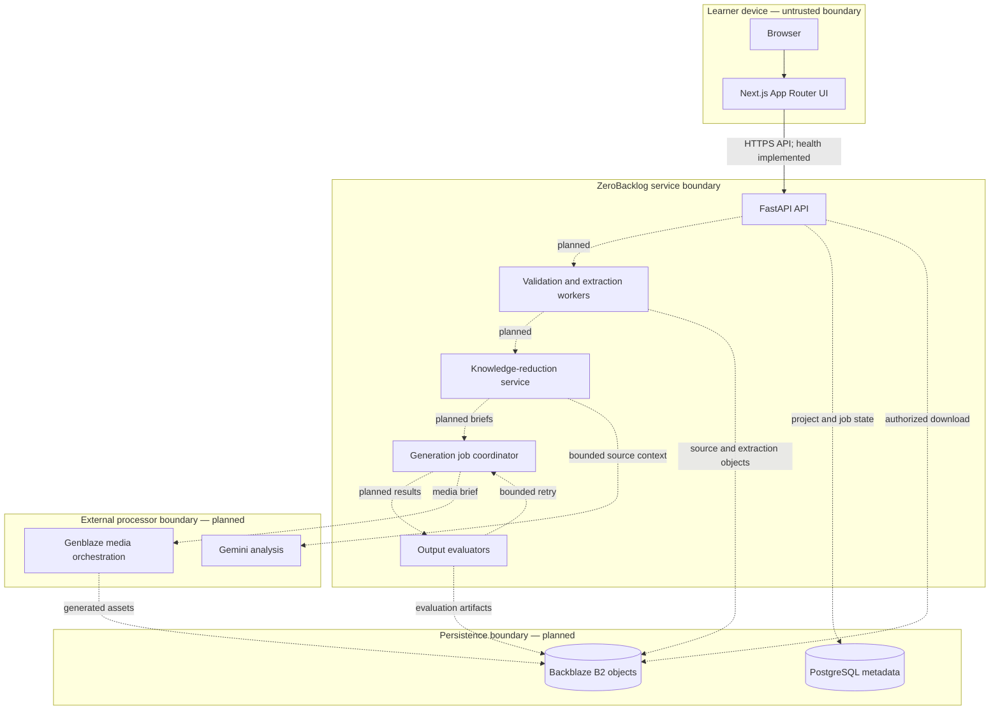
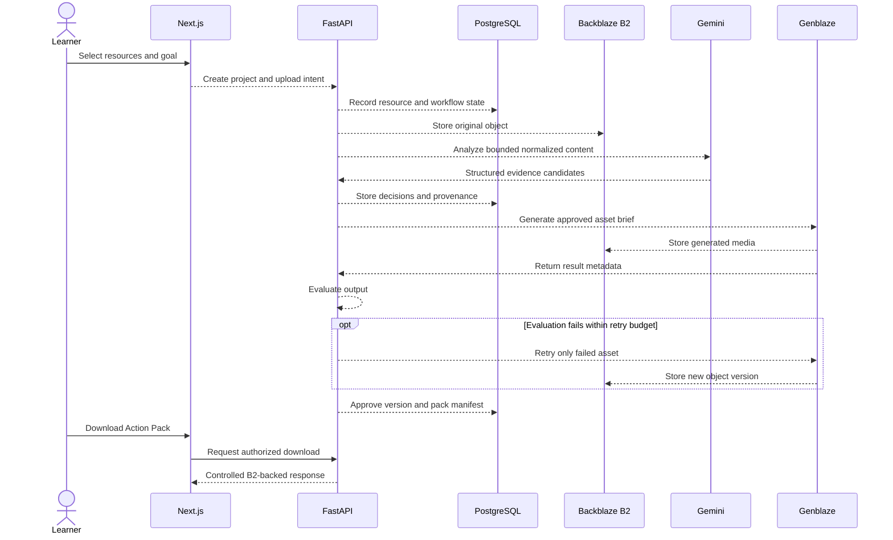

# ZeroBacklog Architecture

## Status and scope

This document describes both the **implemented foundation** and the **planned hackathon architecture**. Today, only the Next.js product preview, FastAPI health surface, environment configuration, logging, exception policy, CORS, and backend tests exist. Every data-processing, AI, Genblaze, PostgreSQL, and Backblaze B2 flow below is a design target.

## System context

ZeroBacklog sits between a learner's accumulated resources and the next learning action. It will accept user-directed sources, reduce them into evidence-linked decisions, generate selected learning media, and preserve originals and derivatives for versioned download.

Primary actors and systems:

- **Learner:** creates a project, submits resources, reviews transparent processing states, and downloads an Action Pack.
- **Next.js frontend:** presents project state and makes authenticated API requests in the future.
- **FastAPI backend:** owns validation, workflow state, policy, orchestration, and public contracts.
- **PostgreSQL:** will own searchable relational metadata and workflow state.
- **Backblaze B2:** will own durable original and generated object bytes.
- **Gemini:** will analyze normalized source material and support knowledge-reduction decisions.
- **Genblaze:** will orchestrate the selected text, image, and voice generation jobs.

## Component diagram

Solid connections are implemented; dashed connections are planned.

## Responsibilities

### Frontend

Implemented responsibilities:

- render a responsive, semantic product foundation;
- read `NEXT_PUBLIC_API_BASE_URL`;
- call the versioned API health endpoint;
- distinguish loading, connected, unavailable, and retry states; and
- avoid implying that planned processing is already available.

Future responsibilities:

- collect project goals and resource selections;
- upload directly or through backend-issued authorization;
- render per-resource validation and processing states;
- display evidence, confidence, decisions, and provenance;
- request selective regeneration; and
- initiate a controlled Action Pack download.

The frontend must never receive provider credentials, B2 application keys, database URLs, or hidden system prompts.

### Backend

Implemented responsibilities:

- load validated settings from `backend/.env`;
- keep secret configuration out of representations and health output;
- configure secret-aware structured logging;
- expose public health contracts;
- enforce configured-origin CORS; and
- return stable centralized error shapes.

Future responsibilities:

- authenticate and authorize project operations;
- issue resource and object identifiers;
- validate input size, type, ownership, and state transitions;
- coordinate extraction, analysis, generation, evaluation, and retry;
- apply idempotency and bounded retry policies;
- maintain source-to-derivative provenance;
- issue short-lived upload/download authorization; and
- enforce retention and deletion policy.

### PostgreSQL — future

PostgreSQL will be the source of truth for metadata that must be queried or transacted:

- users, projects, membership, and permissions;
- resources, source versions, checksums, and validation state;
- processing jobs, stage transitions, attempts, and error categories;
- normalized topic/evidence references;
- learner decisions and Action Pack manifests;
- B2 object identifiers and logical relationships; and
- audit timestamps, retention state, and deletion status.

Large files and generated media do not belong in database rows. A database record should point to a B2 object and record its checksum, version, media type, size, and provenance.

### Backblaze B2 — future

B2 will be the durable byte store for:

- original uploads;
- safe normalized/extracted derivatives;
- generated text, diagram/image, card, and voice artifacts;
- evaluation outputs and rejected attempt artifacts where retention is justified;
- pack manifests and downloadable archives.

Object names should use server-generated, non-identifying IDs. Authorization should use a least-privilege application key and, where supported by the chosen upload design, short-lived scoped URLs. B2 object metadata should carry non-sensitive correlation fields only. PostgreSQL remains authoritative for access decisions.

Versioning is central to the product: a selective regeneration creates a new derivative version linked to the same brief and source set; it must not silently replace the learner's approved result.

### Gemini — future

Gemini will receive bounded normalized content and an explicit analysis contract. It will support:

- topic and concept comparison;
- repeated-content detection;
- unique-insight and contradiction candidates;
- evidence-linked value estimates; and
- structured decision inputs.

Model output is advisory and untrusted until schema validation and product rules complete. Claims must remain linked to source spans, and low-confidence or conflicting evidence must be visible to the learner.

### Genblaze — future

Genblaze will orchestrate generation only after the decision layer identifies a useful asset. It will:

- accept a source-linked generation brief;
- route work to text, image, or voice generation;
- provide observable job and attempt state;
- deliver outputs for storage and evaluation;
- support output-level selective retries; and
- return correlation metadata needed for provenance.

The backend remains responsible for access control, attempt budgets, durable state transitions, and deciding whether an output can enter an Action Pack.

## Planned request and data flow

1. The learner creates a project and states a learning goal.
2. The backend issues resource IDs and validates upload intent.
3. The source is accepted, hashed, and stored in a project-scoped B2 key.
4. PostgreSQL records the object reference, checksum, validation state, and media metadata.
5. An extractor produces a normalized derivative with source-span provenance.
6. Gemini compares only bounded, supported material and returns structured analysis candidates.
7. The decision layer applies rules and learner context to form consume, skim, practice, or skip recommendations.
8. The learner approves desired media, or the product applies clearly disclosed defaults.
9. Genblaze receives an asset-specific, source-linked brief.
10. The resulting asset is written to B2, recorded in PostgreSQL, and evaluated.
11. A failed evaluation triggers a bounded, idempotent retry of only that asset.
12. Approved versions are added to an Action Pack manifest.
13. The backend authorizes or streams the requested pack download.

This sequence is planned and not present in the current application.

## Security boundaries

### Browser boundary

- Browser input, filenames, URLs, MIME types, and model-visible content are untrusted.
- `NEXT_PUBLIC_` configuration is public by design.
- Future authentication state must be protected against cross-site request forgery or use an API token pattern with equivalent controls.
- Error responses must be useful without exposing internal paths, prompts, credentials, or provider responses.

### API boundary

- Enforce authentication, authorization, size limits, rate limits, supported media types, and state transitions.
- Generate object identifiers server-side.
- Do not accept a B2 key or arbitrary object path from the client.
- Avoid secrets and user content in URLs, logs, metrics labels, and exception messages.
- Treat external provider responses as untrusted and validate every structured result.

### Storage boundary

- Use a bucket-scoped, least-privilege B2 application key; separate runtime and administrative credentials.
- Keep B2 identifiers and signed access server-side.
- Store sensitive access policy in PostgreSQL, not object metadata.
- Check checksums before marking an object ready.
- Define retention, deletion, legal, and backup behavior before accepting real user data.

### AI boundary

- Minimize and bound the material sent to providers.
- Separate system instructions from user content and guard against prompt injection in sources.
- Require structured responses where possible and reject schema violations.
- Preserve evidence links and present uncertainty.
- Do not let model output directly authorize deletion, access, or workflow completion.

## Error and retry strategy

Every future job stage should have an explicit state:

`queued → running → succeeded | partial | failed | retryable`

Principles:

- **Stable public errors:** clients receive a code, safe message, and future correlation ID.
- **Detailed internal telemetry:** logs record stage, identifiers, attempt, duration, and safe category—never raw secrets or full user content.
- **Idempotency:** an operation key prevents duplicate uploads, generations, or pack creation after network retries.
- **Bounded retries:** retry transient provider, network, and throttling errors with exponential backoff and jitter; do not retry validation or unsupported-format errors.
- **Selective retry:** retry the smallest failed unit, such as one audio asset, rather than the entire project.
- **Partial results:** preserve successful resources and clearly label incomplete analysis.
- **Dead-letter visibility:** exhausted jobs remain inspectable and actionable instead of disappearing.
- **Version preservation:** a retry produces a new attempt/version record; approved prior versions remain available until retention policy removes them.

The current backend provides only centralized error responses; durable job state and retry machinery are planned.

## Low-RAM development considerations

The architecture should remain usable on a modest student machine:

- run frontend and API as separate lightweight processes;
- stream future uploads instead of reading whole files into memory;
- use bounded chunk sizes for extraction and analysis;
- keep large bytes in B2 and pass references between stages;
- process one heavy local task per worker by default;
- avoid loading full PDF/video corpora into a single prompt or process;
- use provider-hosted generation for media-heavy work;
- page project results and lazy-load media previews;
- prefer background jobs over long request handlers;
- permit a development mode with smaller limits and representative fixtures; and
- make optional services start independently so frontend/backend health work without AI credentials.

The current milestone deliberately avoids containers, local model runtimes, queues, and database processes to keep setup and memory use small.

## Architectural decisions deferred

- authentication provider and tenant model;
- direct-to-B2 versus backend-streamed uploads;
- job queue and worker runtime;
- PostgreSQL schema and migration tool;
- extraction libraries and sandboxing strategy;
- exact Gemini model and prompt/evaluation contracts;
- Genblaze workflow definitions;
- B2 lifecycle, bucket separation, and object-lock policy;
- telemetry platform and correlation-ID design; and
- deployment platform and network topology.

These decisions should be made with a working vertical slice and measured constraints, not guessed into the foundation.
